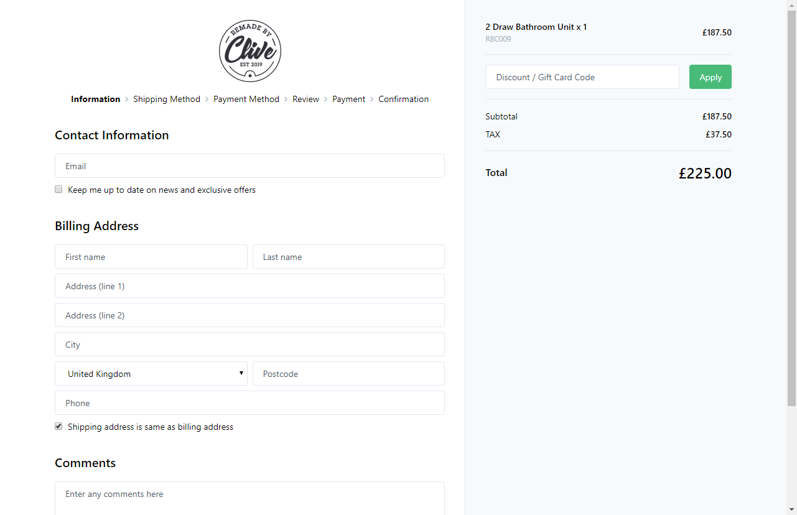

# Vendr Checkout

A ready made checkout flow for [Vendr](http://vendr.net) , the eCommerce solution for [Umbraco v8](https://umbraco.com)

## About

Vendr Checkout is an add-on package for Vendr, the Umbraco v8+ eCommerce solution, providing a drop-in checkout flow solution.

With Vendr Checkout you can quickly and easily add a ready made, themeable and responsive checkout flow onto your site, saving hours of custom development. 

## System Requirements

To get started with the Vendr demo store you will need:

* Visual Studio 2017 (15.9.7+)
* .NET SDK 4.7.2 or newer
* Umbraco 8.2 or newer
* Vendr 1.2 or newer

## Raising an Issue

If you find any issues with the Vendr Checkout add-on itself please raise them in the [issues section of this repository](https://github.com/vendrhub/vendr-checkout/issues), if the issue is a core Vendr product issue however, please raise these in the [issue tracker on the Vendr repository](https://github.com/vendrhub/vendr/issues)

## License

Copyright © 2020 Outfield Digital Ltd

Vendr Checkout is [licensed under MIT](LICENSE.md). The core Vendr product is licensed under an [Outfield Digital commercial license](https://vendr.net/licence-agreement/).

